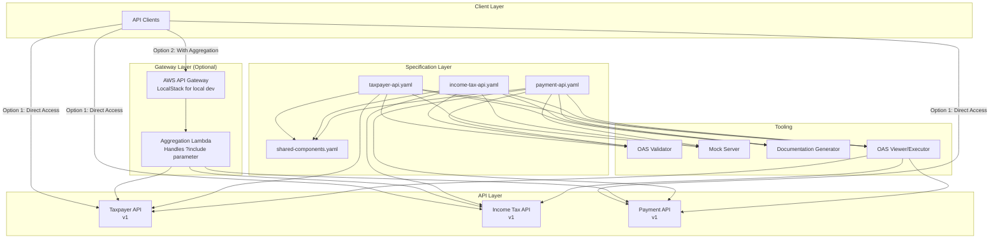

# Design Document: Domain API POC

## Overview

This design describes a proof-of-concept implementation for a multi-API domain architecture representing portions of the UK tax system. The system demonstrates how to model complex domains across multiple RESTful APIs while maintaining clear boundaries, shared components, and cross-API resource traversal capabilities.

The POC will implement three separate Domain APIs:
1. **Taxpayer API**: Manages taxpayer identity and registration information
2. **Income Tax API**: Handles income tax returns, assessments, and calculations
3. **Payment API**: Manages tax payments and payment allocations

Each API will have its own OpenAPI specification, but they will share common components (e.g., Address, Money, Date types) through reusable specification fragments. Resources will include lightweight relationship links inspired by JSON API, allowing clients to traverse between related resources across API boundaries.

### Key Design Principles

- **Domain Boundaries**: Each API represents a distinct subdomain with clear responsibilities
- **Loose Coupling**: APIs are independently deployable and versioned
- **Shared Vocabulary**: Common types are defined once and reused via OpenAPI $ref
- **Hypermedia Navigation**: Resources include links to related resources, enabling discovery
- **Simplicity**: Lightweight JSON structure without full JSON API compliance overhead

## Architecture

### System Components



### API Boundaries

**Taxpayer API** (`/taxpayer/v1`)
- Manages taxpayer registration and identity
- Resources: Taxpayer, Address, ContactDetails
- Relationships: Links to tax returns (Income Tax API), payments (Payment API)

**Income Tax API** (`/income-tax/v1`)
- Manages income tax returns and assessments
- Resources: TaxReturn, Assessment, TaxCalculation
- Relationships: Links to taxpayer (Taxpayer API), payments (Payment API)

**Payment API** (`/payment/v1`)
- Manages tax payments and allocations
- Resources: Payment, PaymentAllocation, PaymentMethod
- Relationships: Links to taxpayer (Taxpayer API), tax returns (Income Tax API)

### Gateway Layer

The gateway layer provides cross-API aggregation capabilities, allowing clients to request related resources from multiple APIs in a single request using the `include` query parameter.

**AWS API Gateway**:
- REST API endpoint that proxies requests to backend APIs
- Routes requests based on path and method
- Integrates with Lambda for aggregation logic
- Local development via LocalStack (emulates AWS API Gateway locally)
- Production deployment to AWS API Gateway

**Aggregation Lambda**:
- Parses `include` query parameter from requests
- Makes parallel requests to backend APIs
- Merges responses into unified `_included` structure
- Handles partial failures gracefully
- Returns standard error responses for gateway-level issues
- Implementation: Node.js/TypeScript for type safety and OpenAPI integration

**Gateway Access Patterns**:
- **Direct Access**: Clients call backend APIs directly, follow `_links` for traversal
- **Gateway Access**: Clients call through API Gateway, use `include` for aggregation

**LocalStack Setup**:
- Docker-based AWS service emulation
- Supports API Gateway, Lambda, and other AWS services
- Enables local development without AWS account
- Configuration via docker-compose or CLI
- Same API Gateway configuration works in both LocalStack and AWS

### Tooling Components

**OAS Validator**:
- Validates OpenAPI specification files against OpenAPI 3.0+ schema
- Checks $ref resolution and shared component references
- Runs as part of build/CI pipeline

**Mock Server**:
- Generates mock API servers from OAS files
- Provides realistic responses based on examples in OAS
- Enables testing without full implementation
- Tools: Prism, OpenAPI Generator

**Documentation Generator**:
- Generates human-readable API documentation from OAS files
- Produces static HTML documentation
- Tools: Redoc, Swagger UI, Stoplight

**OAS Viewer/Executor**:
- Interactive tool for viewing and executing API requests
- Combines documentation viewing with request execution
- Key features:
  - Browse API endpoints and schemas
  - Execute requests directly from the interface
  - View request/response examples
  - Test cross-API traversal by following relationship links
  - Validate responses against OAS schemas
- Tools: Swagger UI (with "Try it out" feature), Postman, Insomnia
- Distinction from Documentation Generator:
  - Documentation Generator: Static, read-only HTML documentation
  - OAS Viewer/Executor: Interactive tool for both viewing AND executing API calls

The OAS Viewer/Executor is essential for the POC as it allows developers to:
1. Explore the API structure interactively
2. Test cross-API relationships by following links
3. Validate that responses match the OAS specifications
4. Demonstrate the multi-API architecture to stakeholders

### Cross-API Relationships


### Gateway Implementation

The gateway layer implements cross-API aggregation using AWS API Gateway and Lambda functions. This section describes the implementation approach for both local development (LocalStack) and production (AWS).

#### Architecture Pattern

```
Client Request with ?include
         ↓
   AWS API Gateway
         ↓
   Aggregation Lambda
         ↓
    ┌────┴────┬────────┐
    ↓         ↓        ↓
Taxpayer  Income Tax  Payment
   API       API       API
    ↓         ↓        ↓
    └────┬────┴────────┘
         ↓
   Merged Response
```

#### AWS API Gateway Configuration

The API Gateway acts as a proxy to the aggregation Lambda:

```yaml
# API Gateway REST API (OpenAPI 3.0 format)
openapi: 3.0.3
info:
  title: Domain API Gateway
  version: 1.0.0
paths:
  /{proxy+}:
    x-amazon-apigateway-any-method:
      parameters:
        - name: proxy
          in: path
          required: true
          schema:
            type: string
        - name: include
          in: query
          required: false
          schema:
            type: string
          description: Comma-separated list of relationships to include
      x-amazon-apigateway-integration:
        type: aws_proxy
        httpMethod: POST
        uri: arn:aws:apigateway:${AWS::Region}:lambda:path/2015-03-31/functions/${AggregationLambda.Arn}/invocations
        passthroughBehavior: when_no_match
```

#### Aggregation Lambda Implementation

The Lambda function handles the aggregation logic:

**Key Responsibilities**:
1. Parse incoming API Gateway event
2. Extract `include` parameter from query string
3. Forward request to appropriate backend API
4. If `include` is present, fetch related resources
5. Merge responses into unified structure
6. Return aggregated response

**Implementation Approach** (TypeScript/Node.js):

```typescript
// Lambda handler structure
export async function handler(event: APIGatewayProxyEvent): Promise<APIGatewayProxyResult> {
  const { path, httpMethod, queryStringParameters, body } = event;
  const includeParam = queryStringParameters?.include;
  
  try {
    // 1. Route to appropriate backend API
    const backendUrl = routeToBackend(path);
    
    // 2. Fetch primary resource
    const primaryResponse = await fetch(backendUrl, {
      method: httpMethod,
      body: body,
      headers: { 'Content-Type': 'application/json' }
    });
    
    const primaryData = await primaryResponse.json();
    
    // 3. If no include parameter, return as-is
    if (!includeParam) {
      return {
        statusCode: primaryResponse.status,
        body: JSON.stringify(primaryData),
        headers: { 'Content-Type': 'application/json' }
      };
    }
    
    // 4. Parse include parameter and fetch related resources
    const includes = includeParam.split(',').map(s => s.trim());
    const includedData = await fetchIncludedResources(primaryData, includes);
    
    // 5. Merge and return
    const aggregatedResponse = {
      ...primaryData,
      _included: includedData
    };
    
    return {
      statusCode: 200,
      body: JSON.stringify(aggregatedResponse),
      headers: { 'Content-Type': 'application/json' }
    };
    
  } catch (error) {
    return {
      statusCode: 502,
      body: JSON.stringify({
        error: {
          code: 'GATEWAY_ERROR',
          message: 'Failed to aggregate resources',
          details: error.message
        }
      }),
      headers: { 'Content-Type': 'application/json' }
    };
  }
}

// Helper: Route request to appropriate backend API
function routeToBackend(path: string): string {
  const backends = {
    '/taxpayer/': process.env.TAXPAYER_API_URL,
    '/income-tax/': process.env.INCOME_TAX_API_URL,
    '/payment/': process.env.PAYMENT_API_URL
  };
  
  for (const [prefix, url] of Object.entries(backends)) {
    if (path.startsWith(prefix)) {
      return `${url}${path}`;
    }
  }
  
  throw new Error(`No backend found for path: ${path}`);
}

// Helper: Fetch included resources based on _links
async function fetchIncludedResources(
  primaryData: any,
  includes: string[]
): Promise<Record<string, any[]>> {
  const links = primaryData._links || {};
  const includedData: Record<string, any[]> = {};
  
  // Fetch each requested relationship in parallel
  const fetchPromises = includes.map(async (relationshipName) => {
    const link = links[relationshipName];
    if (!link || !link.href) {
      return; // Skip if link doesn't exist
    }
    
    try {
      const response = await fetch(link.href);
      if (response.ok) {
        const data = await response.json();
        // Handle both single resources and collections
        includedData[relationshipName] = Array.isArray(data.items) 
          ? data.items 
          : [data];
      }
    } catch (error) {
      console.error(`Failed to fetch ${relationshipName}:`, error);
      // Continue with partial results
    }
  });
  
  await Promise.all(fetchPromises);
  return includedData;
}
```

#### LocalStack Configuration

For local development, use LocalStack to emulate AWS services:

**docker-compose.yml**:
```yaml
version: '3.8'

services:
  localstack:
    image: localstack/localstack:latest
    ports:
      - "4566:4566"  # LocalStack gateway
      - "4510-4559:4510-4559"  # External services port range
    environment:
      - SERVICES=apigateway,lambda,iam,cloudformation
      - DEBUG=1
      - LAMBDA_EXECUTOR=docker
      - DOCKER_HOST=unix:///var/run/docker.sock
    volumes:
      - "/var/run/docker.sock:/var/run/docker.sock"
      - "./localstack-init:/etc/localstack/init/ready.d"  # Init scripts
  
  taxpayer-api:
    image: stoplight/prism:latest
    command: mock -h 0.0.0.0 /specs/taxpayer-api.yaml
    ports:
      - "8081:4010"
    volumes:
      - ./specs/taxpayer:/specs
  
  income-tax-api:
    image: stoplight/prism:latest
    command: mock -h 0.0.0.0 /specs/income-tax-api.yaml
    ports:
      - "8082:4010"
    volumes:
      - ./specs/income-tax:/specs
  
  payment-api:
    image: stoplight/prism:latest
    command: mock -h 0.0.0.0 /specs/payment-api.yaml
    ports:
      - "8083:4010"
    volumes:
      - ./specs/payment:/specs
```

**LocalStack Initialization Script** (`tools/localstack-init.sh`):
```bash
#!/bin/bash
# LocalStack initialization script for API Gateway and Lambda setup
# This script is called by the Taskfile during gateway setup

set -e

echo "Waiting for LocalStack to be ready..."
awslocal apigateway get-rest-apis || exit 1

echo "Creating Lambda function..."
cd /tmp
zip aggregation-lambda.zip index.js
awslocal lambda create-function \
  --function-name aggregation-lambda \
  --runtime nodejs18.x \
  --role arn:aws:iam::000000000000:role/lambda-role \
  --handler index.handler \
  --zip-file fileb://aggregation-lambda.zip

echo "Creating API Gateway..."
API_ID=$(awslocal apigateway create-rest-api \
  --name domain-api-gateway \
  --query 'id' \
  --output text)

# Get root resource
ROOT_ID=$(awslocal apigateway get-resources \
  --rest-api-id $API_ID \
  --query 'items[0].id' \
  --output text)

# Create proxy resource
RESOURCE_ID=$(awslocal apigateway create-resource \
  --rest-api-id $API_ID \
  --parent-id $ROOT_ID \
  --path-part '{proxy+}' \
  --query 'id' \
  --output text)

# Create ANY method
awslocal apigateway put-method \
  --rest-api-id $API_ID \
  --resource-id $RESOURCE_ID \
  --http-method ANY \
  --authorization-type NONE

# Create Lambda integration
awslocal apigateway put-integration \
  --rest-api-id $API_ID \
  --resource-id $RESOURCE_ID \
  --http-method ANY \
  --type AWS_PROXY \
  --integration-http-method POST \
  --uri arn:aws:apigateway:us-east-1:lambda:path/2015-03-31/functions/arn:aws:lambda:us-east-1:000000000000:function:aggregation-lambda/invocations

# Deploy API
awslocal apigateway create-deployment \
  --rest-api-id $API_ID \
  --stage-name dev

echo "✓ API Gateway setup complete"
echo "API Gateway URL: http://localhost:4566/restapis/$API_ID/dev/_user_request_/taxpayer/v1/taxpayers"
```

#### Taskfile Integration

Common gateway operations are managed via Taskfile:

**Taskfile.yaml**:
```yaml
version: '3'

tasks:
  gateway:start:
    desc: Start LocalStack and backend mock servers
    cmds:
      - docker-compose up -d localstack taxpayer-api income-tax-api payment-api
      - echo "Waiting for services to be ready..."
      - sleep 5
      - task: gateway:init

  gateway:init:
    desc: Initialize API Gateway and Lambda in LocalStack
    cmds:
      - chmod +x tools/localstack-init.sh
      - docker-compose exec localstack /tools/localstack-init.sh

  gateway:stop:
    desc: Stop LocalStack and backend services
    cmds:
      - docker-compose down

  gateway:logs:
    desc: View gateway logs
    cmds:
      - docker-compose logs -f localstack

  gateway:test:
    desc: Test gateway aggregation
    cmds:
      - |
        echo "Testing direct API access..."
        curl http://localhost:8081/taxpayer/v1/taxpayers/TP123456
        echo ""
        echo "Testing gateway with include parameter..."
        curl "http://localhost:4566/restapis/\${API_ID}/dev/_user_request_/taxpayer/v1/taxpayers/TP123456?include=taxReturns"

  gateway:status:
    desc: Check gateway and backend API status
    cmds:
      - docker-compose ps
      - echo "Checking LocalStack API Gateway..."
      - docker-compose exec localstack awslocal apigateway get-rest-apis

  lambda:build:
    desc: Build aggregation Lambda function
    dir: gateway/lambda
    cmds:
      - npm install
      - npm run build
      - zip -r aggregation-lambda.zip dist/ node_modules/

  lambda:deploy:
    desc: Deploy Lambda to LocalStack
    deps: [lambda:build]
    cmds:
      - docker-compose exec localstack awslocal lambda update-function-code \
          --function-name aggregation-lambda \
          --zip-file fileb:///tmp/aggregation-lambda.zip

  lambda:logs:
    desc: View Lambda logs
    cmds:
      - docker-compose exec localstack awslocal logs tail /aws/lambda/aggregation-lambda --follow
```

#### Deployment Considerations

**Local Development**:
- Use LocalStack for AWS service emulation
- Use Prism mock servers for backend APIs
- Lambda runs in Docker containers
- Fast iteration without AWS costs

**Production Deployment**:
- Deploy to AWS API Gateway (REST API)
- Deploy Lambda to AWS Lambda service
- Backend APIs run as containers or serverless
- Use AWS CDK or CloudFormation for infrastructure as code
- Consider API Gateway caching for performance
- Implement proper IAM roles and permissions

**Environment Variables**:
```bash
# Backend API URLs (different per environment)
TAXPAYER_API_URL=http://taxpayer-api:8081
INCOME_TAX_API_URL=http://income-tax-api:8082
PAYMENT_API_URL=http://payment-api:8083

# LocalStack endpoint (local only)
AWS_ENDPOINT_URL=http://localhost:4566
```

#### Error Handling in Gateway

The gateway handles various error scenarios:

**Backend API Unavailable**:
```json
{
  "error": {
    "code": "UPSTREAM_API_ERROR",
    "message": "Unable to reach Income Tax API",
    "status": 502,
    "upstreamService": "income-tax-api"
  }
}
```

**Partial Include Failure**:
- Gateway returns primary resource successfully
- Omits failed includes from `_included`
- Logs errors for monitoring
- Client can retry specific relationships

**Invalid Include Parameter**:
- Gateway ignores unknown relationship names
- Only fetches relationships present in `_links`
- No error returned for invalid includes

## Components and Interfaces

### OpenAPI Specification Structure

Each API will have its own OpenAPI 3.0 specification file with the following structure:

```yaml
openapi: 3.0.3
info:
  title: {API Name}
  version: 1.0.0
  description: {API Description}
servers:
  - url: http://localhost:8080/{domain}/v1
paths:
  # API endpoints
components:
  schemas:
    # Local schemas
  parameters:
    # Reusable parameters
  responses:
    # Reusable responses
  examples:
    # Example data
```

### Shared Components Structure

The `shared-components.yaml` file will define reusable types:

```yaml
components:
  schemas:
    Address:
      type: object
      required: [line1, postcode, country]
      properties:
        line1: {type: string}
        line2: {type: string}
        line3: {type: string}
        postcode: {type: string, pattern: '^[A-Z]{1,2}[0-9][A-Z0-9]? ?[0-9][A-Z]{2}$'}
        country: {type: string, enum: [GB, UK]}
    
    Money:
      type: object
      required: [amount, currency]
      properties:
        amount: {type: number, format: decimal}
        currency: {type: string, enum: [GBP], default: GBP}
    
    DateRange:
      type: object
      required: [startDate, endDate]
      properties:
        startDate: {type: string, format: date}
        endDate: {type: string, format: date}
    
    Links:
      type: object
      description: Hypermedia links to related resources
      properties:
        self: {type: string, format: uri}
      additionalProperties:
        type: object
        properties:
          href: {type: string, format: uri}
          type: {type: string}
          title: {type: string}
```

### Resource Structure Pattern

All resources follow a consistent structure:

```json
{
  "id": "string",
  "type": "resource-type",
  "attributes": {
    // Resource-specific attributes
  },
  "_links": {
    "self": {"href": "http://api/resource/id"},
    "related-resource": {
      "href": "http://other-api/resource/id",
      "type": "resource-type",
      "title": "Human readable description"
    }
  }
}
```

### Query Parameter: Include Related Resources

To minimize the number of API requests, clients can use the `include` query parameter to embed related resources in the response. This feature is implemented by the **Gateway Layer** (AWS API Gateway + Lambda), not by the backend APIs themselves.

**Access Patterns**:

1. **Direct API Access** (no gateway):
   - Client calls backend APIs directly
   - Client follows `_links` to traverse relationships
   - Multiple HTTP requests required for related resources
   - Example: `GET http://taxpayer-api:8081/taxpayer/v1/taxpayers/TP123456`

2. **Gateway Access** (with aggregation):
   - Client calls through AWS API Gateway
   - Gateway Lambda handles `include` parameter
   - Single HTTP request returns aggregated response
   - Example: `GET http://api-gateway/taxpayer/v1/taxpayers/TP123456?include=taxReturns`

**Single Resource with Includes**:
```
GET /taxpayer/v1/taxpayers/{id}?include=taxReturns,payments
```

**Collection with Includes**:
```
GET /taxpayer/v1/taxpayers?include=taxReturns
```

When the `include` parameter is used, the gateway aggregation Lambda:
1. Parses the `include` parameter
2. Fetches the primary resource from the backend API
3. Extracts relationship URLs from `_links`
4. Makes parallel requests to related backend APIs
5. Merges responses into `_included` field
6. Returns unified response to client

The response includes an `_included` field containing the related resources:

```json
{
  "id": "TP123456",
  "type": "taxpayer",
  "nino": "AB123456C",
  "name": {
    "firstName": "John",
    "lastName": "Smith"
  },
  "_links": {
    "self": {"href": "http://localhost:8080/taxpayer/v1/taxpayers/TP123456"},
    "taxReturns": {
      "href": "http://localhost:8080/income-tax/v1/tax-returns?taxpayerId=TP123456",
      "type": "collection"
    }
  },
  "_included": {
    "taxReturns": [
      {
        "id": "TR20230001",
        "type": "tax-return",
        "taxpayerId": "TP123456",
        "taxYear": "2023-24",
        "status": "assessed",
        "_links": {
          "self": {"href": "http://localhost:8080/income-tax/v1/tax-returns/TR20230001"}
        }
      }
    ]
  }
}
```

**Include Parameter Rules**:
- Multiple relationships can be included using comma-separated values: `?include=rel1,rel2`
- Only relationships defined in `_links` can be included
- Cross-API includes are supported (e.g., Taxpayer API can include resources from Income Tax API)
- If a relationship doesn't exist or returns no data, the field is omitted from `_included`
- The `_links` field is always present, even when `_included` is used
- For collection endpoints, `_included` is at the collection level, not nested in each item
- Each item references its included resources by ID
- Backend APIs are unaware of the `include` parameter - aggregation is purely a gateway concern

**Collection with Include Example**:

Request: `GET /taxpayers?include=taxReturns`

Response:
```json
{
  "items": [
    {
      "id": "TP123456",
      "type": "taxpayer",
      "nino": "AB123456C",
      "name": {"firstName": "John", "lastName": "Smith"},
      "_links": {
        "self": {"href": "http://localhost:8080/taxpayer/v1/taxpayers/TP123456"},
        "taxReturns": {
          "href": "http://localhost:8080/income-tax/v1/tax-returns?taxpayerId=TP123456",
          "type": "collection"
        }
      },
      "_includes": {
        "taxReturns": ["TR20230001", "TR20220001"]
      }
    },
    {
      "id": "TP789012",
      "type": "taxpayer",
      "nino": "CD789012E",
      "name": {"firstName": "Jane", "lastName": "Doe"},
      "_links": {
        "self": {"href": "http://localhost:8080/taxpayer/v1/taxpayers/TP789012"},
        "taxReturns": {
          "href": "http://localhost:8080/income-tax/v1/tax-returns?taxpayerId=TP789012",
          "type": "collection"
        }
      },
      "_includes": {
        "taxReturns": ["TR20230002"]
      }
    }
  ],
  "_included": {
    "taxReturns": [
      {
        "id": "TR20230001",
        "type": "tax-return",
        "taxpayerId": "TP123456",
        "taxYear": "2023-24",
        "status": "assessed",
        "totalIncome": {"amount": 50000.00, "currency": "GBP"},
        "_links": {
          "self": {"href": "http://localhost:8080/income-tax/v1/tax-returns/TR20230001"}
        }
      },
      {
        "id": "TR20220001",
        "type": "tax-return",
        "taxpayerId": "TP123456",
        "taxYear": "2022-23",
        "status": "closed",
        "totalIncome": {"amount": 48000.00, "currency": "GBP"},
        "_links": {
          "self": {"href": "http://localhost:8080/income-tax/v1/tax-returns/TR20220001"}
        }
      },
      {
        "id": "TR20230002",
        "type": "tax-return",
        "taxpayerId": "TP789012",
        "taxYear": "2023-24",
        "status": "submitted",
        "totalIncome": {"amount": 35000.00, "currency": "GBP"},
        "_links": {
          "self": {"href": "http://localhost:8080/income-tax/v1/tax-returns/TR20230002"}
        }
      }
    ]
  },
  "_links": {
    "self": {"href": "http://localhost:8080/taxpayer/v1/taxpayers?include=taxReturns"}
  }
}
```

This structure:
- Avoids duplication when multiple items reference the same included resource
- Keeps the collection response flat and efficient
- Each item has an `_includes` field with IDs referencing resources in the collection-level `_included`
- All included resources are in a single `_included` object at the collection level

### API Endpoints

**Taxpayer API Endpoints**:
- `GET /taxpayers` - List taxpayers
- `GET /taxpayers/{id}` - Get taxpayer details
- `POST /taxpayers` - Create taxpayer
- `PUT /taxpayers/{id}` - Update taxpayer
- `DELETE /taxpayers/{id}` - Delete taxpayer

**Income Tax API Endpoints**:
- `GET /tax-returns` - List tax returns
- `GET /tax-returns/{id}` - Get tax return details
- `POST /tax-returns` - Submit tax return
- `GET /tax-returns/{id}/assessments` - Get assessments for a return
- `GET /assessments/{id}` - Get assessment details

**Payment API Endpoints**:
- `GET /payments` - List payments
- `GET /payments/{id}` - Get payment details
- `POST /payments` - Record payment
- `GET /payments/{id}/allocations` - Get payment allocations
- `POST /allocations` - Create payment allocation

### Relationship Link Format

Relationships are represented in the `_links` object:

```json
{
  "_links": {
    "self": {
      "href": "http://localhost:8080/taxpayer/v1/taxpayers/TP123456"
    },
    "taxReturns": {
      "href": "http://localhost:8080/income-tax/v1/tax-returns?taxpayerId=TP123456",
      "type": "collection",
      "title": "Tax returns for this taxpayer"
    },
    "payments": {
      "href": "http://localhost:8080/payment/v1/payments?taxpayerId=TP123456",
      "type": "collection",
      "title": "Payments made by this taxpayer"
    }
  }
}
```

## Data Models

### Taxpayer API Models

**Taxpayer**:
```yaml
Taxpayer:
  type: object
  required: [id, type, nino, name, address]
  properties:
    id:
      type: string
      pattern: '^TP[0-9]{6}$'
      example: TP123456
    type:
      type: string
      enum: [taxpayer]
    nino:
      type: string
      pattern: '^[A-Z]{2}[0-9]{6}[A-Z]$'
      description: National Insurance Number
      example: AB123456C
    name:
      type: object
      required: [firstName, lastName]
      properties:
        title: {type: string, enum: [Mr, Mrs, Miss, Ms, Dr]}
        firstName: {type: string}
        middleNames: {type: string}
        lastName: {type: string}
    address:
      $ref: 'shared-components.yaml#/components/schemas/Address'
    dateOfBirth:
      type: string
      format: date
    _links:
      $ref: 'shared-components.yaml#/components/schemas/Links'
```

### Income Tax API Models

**TaxReturn**:
```yaml
TaxReturn:
  type: object
  required: [id, type, taxpayerId, taxYear, status]
  properties:
    id:
      type: string
      pattern: '^TR[0-9]{8}$'
      example: TR20230001
    type:
      type: string
      enum: [tax-return]
    taxpayerId:
      type: string
      pattern: '^TP[0-9]{6}$'
    taxYear:
      type: string
      pattern: '^[0-9]{4}-[0-9]{2}$'
      example: 2023-24
    period:
      $ref: 'shared-components.yaml#/components/schemas/DateRange'
    status:
      type: string
      enum: [draft, submitted, assessed, closed]
    totalIncome:
      $ref: 'shared-components.yaml#/components/schemas/Money'
    taxDue:
      $ref: 'shared-components.yaml#/components/schemas/Money'
    _links:
      $ref: 'shared-components.yaml#/components/schemas/Links'
```

**Assessment**:
```yaml
Assessment:
  type: object
  required: [id, type, taxReturnId, assessmentDate, taxDue]
  properties:
    id:
      type: string
      pattern: '^AS[0-9]{8}$'
      example: AS20230001
    type:
      type: string
      enum: [assessment]
    taxReturnId:
      type: string
      pattern: '^TR[0-9]{8}$'
    assessmentDate:
      type: string
      format: date-time
    taxDue:
      $ref: 'shared-components.yaml#/components/schemas/Money'
    dueDate:
      type: string
      format: date
    _links:
      $ref: 'shared-components.yaml#/components/schemas/Links'
```

### Payment API Models

**Payment**:
```yaml
Payment:
  type: object
  required: [id, type, taxpayerId, amount, paymentDate, status]
  properties:
    id:
      type: string
      pattern: '^PM[0-9]{8}$'
      example: PM20230001
    type:
      type: string
      enum: [payment]
    taxpayerId:
      type: string
      pattern: '^TP[0-9]{6}$'
    amount:
      $ref: 'shared-components.yaml#/components/schemas/Money'
    paymentDate:
      type: string
      format: date
    paymentMethod:
      type: string
      enum: [bank-transfer, debit-card, cheque]
    reference:
      type: string
    status:
      type: string
      enum: [pending, cleared, failed, refunded]
    _links:
      $ref: 'shared-components.yaml#/components/schemas/Links'
```

**PaymentAllocation**:
```yaml
PaymentAllocation:
  type: object
  required: [id, type, paymentId, taxReturnId, amount]
  properties:
    id:
      type: string
      pattern: '^PA[0-9]{8}$'
      example: PA20230001
    type:
      type: string
      enum: [payment-allocation]
    paymentId:
      type: string
      pattern: '^PM[0-9]{8}$'
    taxReturnId:
      type: string
      pattern: '^TR[0-9]{8}$'
    amount:
      $ref: 'shared-components.yaml#/components/schemas/Money'
    allocationDate:
      type: string
      format: date-time
    _links:
      $ref: 'shared-components.yaml#/components/schemas/Links'
```

### Example Cross-API Traversal

A complete example showing resource relationships:

**1. Get Taxpayer** (`GET /api/taxpayer/v1/taxpayers/TP123456`):
```json
{
  "id": "TP123456",
  "type": "taxpayer",
  "nino": "AB123456C",
  "name": {
    "firstName": "John",
    "lastName": "Smith"
  },
  "address": {
    "line1": "10 Downing Street",
    "postcode": "SW1A 2AA",
    "country": "GB"
  },
  "_links": {
    "self": {
      "href": "http://localhost:8080/api/taxpayer/v1/taxpayers/TP123456"
    },
    "taxReturns": {
      "href": "http://localhost:8080/api/income-tax/v1/tax-returns?taxpayerId=TP123456",
      "type": "collection",
      "title": "Tax returns for this taxpayer"
    },
    "payments": {
      "href": "http://localhost:8080/api/payment/v1/payments?taxpayerId=TP123456",
      "type": "collection",
      "title": "Payments made by this taxpayer"
    }
  }
}
```

**2. Get Taxpayer with Included Tax Returns** (`GET /api/taxpayer/v1/taxpayers/TP123456?include=taxReturns`):
```json
{
  "id": "TP123456",
  "type": "taxpayer",
  "nino": "AB123456C",
  "name": {
    "firstName": "John",
    "lastName": "Smith"
  },
  "address": {
    "line1": "10 Downing Street",
    "postcode": "SW1A 2AA",
    "country": "GB"
  },
  "_links": {
    "self": {
      "href": "http://localhost:8080/api/taxpayer/v1/taxpayers/TP123456"
    },
    "taxReturns": {
      "href": "http://localhost:8080/api/income-tax/v1/tax-returns?taxpayerId=TP123456",
      "type": "collection",
      "title": "Tax returns for this taxpayer"
    },
    "payments": {
      "href": "http://localhost:8080/api/payment/v1/payments?taxpayerId=TP123456",
      "type": "collection",
      "title": "Payments made by this taxpayer"
    }
  },
  "_includes": {
    "taxReturns": ["TR20230001"]
  },
  "_included": {
    "taxReturns": [
      {
        "id": "TR20230001",
        "type": "tax-return",
        "taxpayerId": "TP123456",
        "taxYear": "2023-24",
        "status": "assessed",
        "totalIncome": {"amount": 50000.00, "currency": "GBP"},
        "taxDue": {"amount": 7500.00, "currency": "GBP"},
        "_links": {
          "self": {
            "href": "http://localhost:8080/api/income-tax/v1/tax-returns/TR20230001"
          },
          "taxpayer": {
            "href": "http://localhost:8080/api/taxpayer/v1/taxpayers/TP123456",
            "type": "taxpayer"
          },
          "assessments": {
            "href": "http://localhost:8080/api/income-tax/v1/tax-returns/TR20230001/assessments",
            "type": "collection"
          }
        }
      }
    ]
  }
}
```

**3. Follow Tax Returns Link** (`GET /api/income-tax/v1/tax-returns?taxpayerId=TP123456`):
```json
{
  "items": [
    {
      "id": "TR20230001",
      "type": "tax-return",
      "taxpayerId": "TP123456",
      "taxYear": "2023-24",
      "status": "assessed",
      "totalIncome": {"amount": 50000.00, "currency": "GBP"},
      "taxDue": {"amount": 7500.00, "currency": "GBP"},
      "_links": {
        "self": {
          "href": "http://localhost:8080/api/income-tax/v1/tax-returns/TR20230001"
        },
        "taxpayer": {
          "href": "http://localhost:8080/api/taxpayer/v1/taxpayers/TP123456",
          "type": "taxpayer",
          "title": "Taxpayer who filed this return"
        },
        "assessments": {
          "href": "http://localhost:8080/api/income-tax/v1/tax-returns/TR20230001/assessments",
          "type": "collection",
          "title": "Assessments for this return"
        },
        "allocations": {
          "href": "http://localhost:8080/api/payment/v1/allocations?taxReturnId=TR20230001",
          "type": "collection",
          "title": "Payment allocations for this return"
        }
      }
    }
  ],
  "_links": {
    "self": {
      "href": "http://localhost:8080/api/income-tax/v1/tax-returns?taxpayerId=TP123456"
    }
  }
}
```


## Correctness Properties

*A property is a characteristic or behavior that should hold true across all valid executions of a system—essentially, a formal statement about what the system should do. Properties serve as the bridge between human-readable specifications and machine-verifiable correctness guarantees.*

### Property Reflection

After analyzing all acceptance criteria, several properties can be consolidated:
- Properties about OAS file structure (2.1, 2.2, 2.3, 2.4) can be combined into comprehensive OAS validation properties
- Properties about resource structure (4.1, 4.2, 4.3) can be combined into a single resource format property
- Properties about relationship links (5.1, 5.2, 5.5) can be combined into a comprehensive link format property
- Properties about validation (8.1, 8.2, 8.5) can be combined into comprehensive validation properties

### Property 1: Domain API Uniqueness

*For any* two Domain APIs in the system, their base URL paths must be distinct and each resource type must belong to exactly one API.

**Validates: Requirements 1.2, 1.3**

### Property 2: Independent API Versioning

*For any* Domain API in the system, it must have its own version identifier that can be changed independently of other APIs.

**Validates: Requirements 1.4**

### Property 3: API Resource Isolation

*For any* request to a Domain API, the response must only contain resources whose types are defined in that API's OpenAPI specification.

**Validates: Requirements 1.5**

### Property 4: OAS File Completeness and Validity

*For any* Domain API, its OpenAPI specification file must be valid according to OpenAPI 3.0+ specification, contain at least one path definition, at least one schema definition, and include examples.

**Validates: Requirements 2.1, 2.2, 2.3, 2.4**

### Property 5: Shared Component References

*For any* $ref reference in a Domain API's OpenAPI specification that points to the shared components file, the reference must resolve to a valid schema definition.

**Validates: Requirements 3.3, 3.5, 8.2**

### Property 6: Resource Structure Format

*For any* resource returned by any Domain API, the response must not have a root-level "data" wrapper, must include resource attributes at the top level, and must include a "_links" field.

**Validates: Requirements 4.1, 4.2, 4.3**

### Property 7: Relationship Link Presence

*For any* resource that has relationships defined in its schema, the response must include URLs to related resources in the "_links" field.

**Validates: Requirements 4.4**

### Property 8: HTTP Method Support

*For any* resource endpoint in any Domain API, the OpenAPI specification must define at least GET and POST methods, and may define PUT, PATCH, and DELETE.

**Validates: Requirements 4.5**

### Property 9: Cross-API Link Format

*For any* relationship link in a resource that points to a resource in a different Domain API, the URL must be absolute (include scheme and host), must include the target API's base path, and must include metadata fields (type, title).

**Validates: Requirements 5.1, 5.2, 5.5**

### Property 10: Link Resolution

*For any* relationship link in a resource response, following that link must return a valid resource from the target API.

**Validates: Requirements 5.3**

### Property 11: Bidirectional Relationships

*For any* resource A that has a relationship link to resource B, resource B must have a relationship link back to resource A.

**Validates: Requirements 5.4**

### Property 12: Documentation Completeness

*For any* endpoint, parameter, or schema in any OpenAPI specification, it must include a description field.

**Validates: Requirements 7.2**

### Property 13: OpenAPI Specification Validation

*For any* OpenAPI specification file in the system, it must pass validation against the OpenAPI 3.0+ specification schema.

**Validates: Requirements 8.1**

### Property 14: Relationship URL Validity

*For any* relationship URL in any resource response, the URL must be syntactically valid and must resolve to an actual resource (return 200 OK or 404 Not Found, not 500 or connection errors).

**Validates: Requirements 8.5**

### Property 15: Include Parameter Embedding

*For any* resource request with an `include` query parameter, if the included relationship exists in the resource's `_links`, the response must contain an `_included` field with the related resources, and the `_links` field must still be present.

**Validates: Requirements 4.4, 5.3** (implicit - reduces need for multiple requests while maintaining link structure)

## Error Handling

### OpenAPI Specification Errors

**Invalid OAS File**:
- Detection: OAS validator reports schema violations
- Response: Build/deployment fails with detailed validation errors
- Recovery: Fix OAS file and re-validate

**Broken $ref Reference**:
- Detection: OAS validator cannot resolve reference
- Response: Build/deployment fails with reference path details
- Recovery: Fix reference path or add missing component

**Version Conflict**:
- Detection: Shared component change breaks referencing API
- Response: Validation fails with compatibility report
- Recovery: Update referencing API or revert shared component change

### Runtime Errors

**Resource Not Found (404)**:
- Scenario: Client follows relationship link to non-existent resource
- Response: Standard 404 with error details
- Example:
```json
{
  "error": {
    "code": "RESOURCE_NOT_FOUND",
    "message": "Tax return TR20230001 not found",
    "status": 404
  }
}
```

**Invalid Request (400)**:
- Scenario: Client sends malformed data or invalid parameters
- Response: 400 with validation errors
- Example:
```json
{
  "error": {
    "code": "VALIDATION_ERROR",
    "message": "Invalid request data",
    "status": 400,
    "details": [
      {"field": "nino", "message": "Must match pattern ^[A-Z]{2}[0-9]{6}[A-Z]$"}
    ]
  }
}
```

**Cross-API Reference Error (502)**:
- Scenario: Relationship link points to unavailable API
- Response: 502 Bad Gateway
- Example:
```json
{
  "error": {
    "code": "UPSTREAM_API_ERROR",
    "message": "Unable to reach Income Tax API",
    "status": 502,
    "upstreamService": "income-tax-api"
  }
}
```

### Validation Errors

**Schema Validation Failure**:
- Detection: Request/response doesn't match OAS schema
- Response: 400 for requests, 500 for responses
- Logging: Log schema validation details for debugging

**Link Validation Failure**:
- Detection: Relationship URL is malformed or unresolvable
- Response: Log warning, optionally omit invalid link
- Recovery: Fix link generation logic

## Testing Strategy

### Dual Testing Approach

The testing strategy employs both unit tests and property-based tests as complementary approaches:

- **Unit tests**: Verify specific examples, edge cases, and error conditions
- **Property tests**: Verify universal properties across all inputs

Together, these provide comprehensive coverage where unit tests catch concrete bugs and property tests verify general correctness.

### Unit Testing

Unit tests will focus on:

**OpenAPI Specification Validation**:
- Test that each OAS file is valid OpenAPI 3.0+
- Test that shared component references resolve correctly
- Test specific examples of valid and invalid specifications

**Resource Structure**:
- Test that example resources match the expected format
- Test that _links field is present and correctly structured
- Test specific examples of cross-API relationships

**Error Handling**:
- Test 404 responses for non-existent resources
- Test 400 responses for invalid requests
- Test 502 responses for unavailable upstream APIs

**Integration Points**:
- Test that mock servers can be generated from OAS files
- Test that documentation can be generated from OAS files
- Test that relationship links can be followed across APIs

### Property-Based Testing

Property-based tests will be implemented using a PBT library appropriate for the implementation language (e.g., Hypothesis for Python, fast-check for TypeScript, QuickCheck for Haskell).

Each property test will:
- Run a minimum of 100 iterations
- Include a comment tag: **Feature: domain-api-poc, Property {number}: {property text}**
- Generate random valid inputs to test universal properties

**Property Test Examples**:

**Property 1: Domain API Uniqueness**
```python
# Feature: domain-api-poc, Property 1: Domain API Uniqueness
@given(apis=list_of_domain_apis())
def test_domain_api_uniqueness(apis):
    base_paths = [api.base_path for api in apis]
    assert len(base_paths) == len(set(base_paths))  # All unique
    
    all_resources = []
    for api in apis:
        all_resources.extend(api.resource_types)
    
    # Each resource type appears in exactly one API
    assert len(all_resources) == len(set(all_resources))
```

**Property 6: Resource Structure Format**
```python
# Feature: domain-api-poc, Property 6: Resource Structure Format
@given(api=domain_api(), resource_id=resource_identifier())
def test_resource_structure_format(api, resource_id):
    response = api.get_resource(resource_id)
    
    # No root-level "data" wrapper
    assert "data" not in response or not isinstance(response.get("data"), dict)
    
    # Has _links field
    assert "_links" in response
    assert isinstance(response["_links"], dict)
    
    # Has resource attributes at top level
    assert "id" in response
    assert "type" in response
```

**Property 10: Link Resolution**
```python
# Feature: domain-api-poc, Property 10: Link Resolution
@given(api=domain_api(), resource_id=resource_identifier())
def test_link_resolution(api, resource_id):
    response = api.get_resource(resource_id)
    links = response.get("_links", {})
    
    for link_name, link_obj in links.items():
        if link_name == "self":
            continue
        
        href = link_obj.get("href")
        if href:
            # Following the link should return a valid response
            linked_response = http_get(href)
            assert linked_response.status_code in [200, 404]
            
            if linked_response.status_code == 200:
                # Response should be valid JSON with expected structure
                data = linked_response.json()
                assert "id" in data or "items" in data  # Single resource or collection
```

**Property 11: Bidirectional Relationships**
```python
# Feature: domain-api-poc, Property 11: Bidirectional Relationships
@given(api_a=domain_api(), api_b=domain_api(), resource_a_id=resource_identifier())
def test_bidirectional_relationships(api_a, api_b, resource_a_id):
    assume(api_a != api_b)  # Different APIs
    
    resource_a = api_a.get_resource(resource_a_id)
    links_a = resource_a.get("_links", {})
    
    # Find links to api_b
    for link_name, link_obj in links_a.items():
        href = link_obj.get("href", "")
        if api_b.base_path in href:
            # Follow link to resource B
            resource_b = http_get(href).json()
            links_b = resource_b.get("_links", {})
            
            # Resource B should link back to resource A
            back_links = [l["href"] for l in links_b.values() if isinstance(l, dict)]
            assert any(resource_a["id"] in link for link in back_links)
```

### Test Configuration

- **Minimum iterations**: 100 per property test
- **Test data generation**: Use realistic UK tax domain data (valid NINOs, tax years, amounts)
- **Edge cases**: Include boundary values (empty strings, zero amounts, maximum values)
- **Error injection**: Test with invalid data to verify error handling

### Mock Server Testing

Mock servers will be generated from OpenAPI specifications using tools like Prism or OpenAPI Generator:

```bash
# Generate mock server from OAS
prism mock taxpayer-api.yaml --port 8081
prism mock income-tax-api.yaml --port 8082
prism mock payment-api.yaml --port 8083
```

Mock servers enable:
- Testing cross-API traversal without full implementation
- Validating request/response formats against OAS
- Demonstrating API behavior to stakeholders

### Documentation Testing

Documentation generation will be tested using tools like Redoc or Swagger UI:

```bash
# Generate documentation
redoc-cli bundle taxpayer-api.yaml -o taxpayer-api-docs.html
redoc-cli bundle income-tax-api.yaml -o income-tax-api-docs.html
redoc-cli bundle payment-api.yaml -o payment-api-docs.html
```

Tests will verify:
- Documentation can be generated without errors
- All endpoints are documented
- Examples are included and render correctly
- Cross-API relationships are explained

